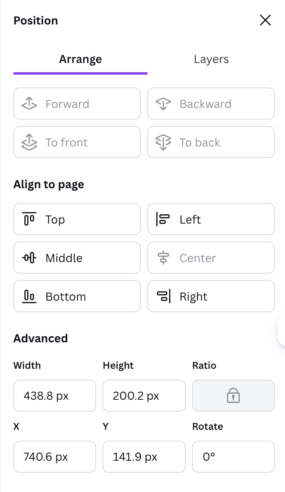
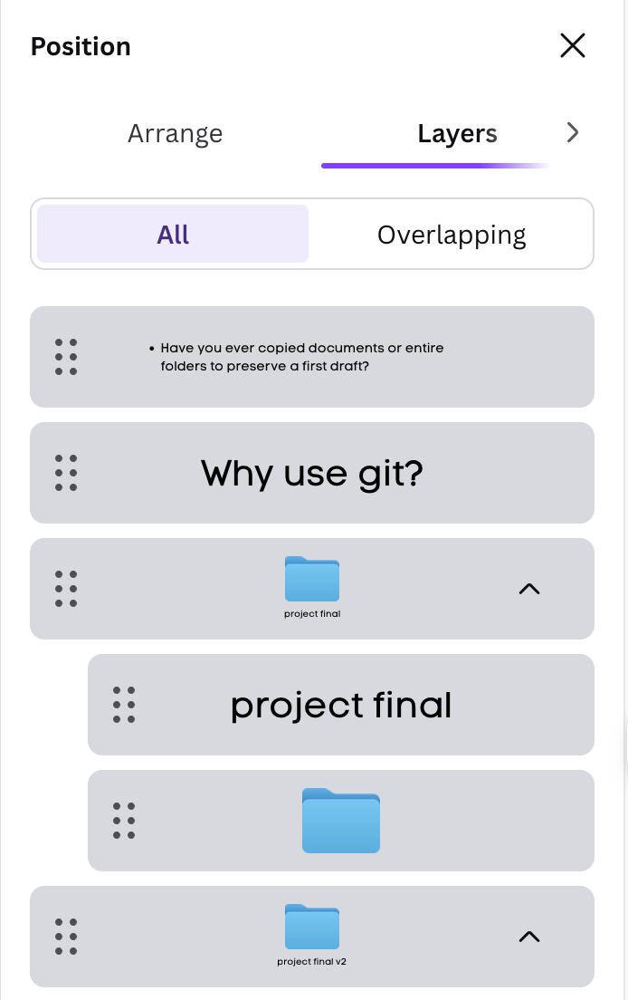
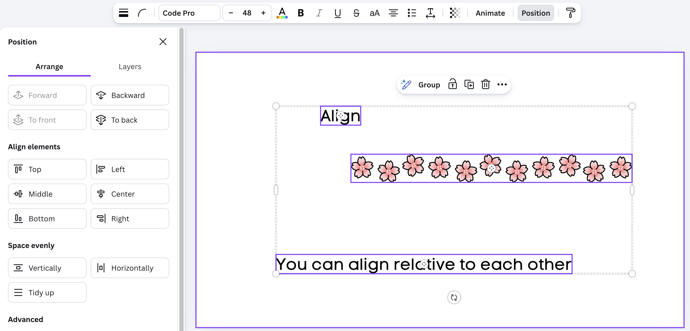
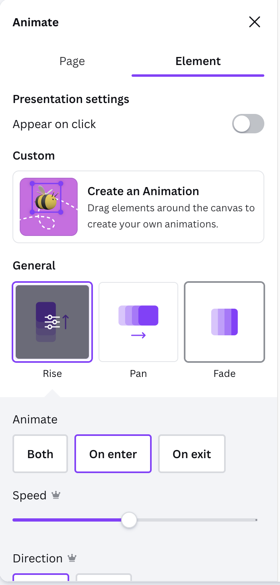
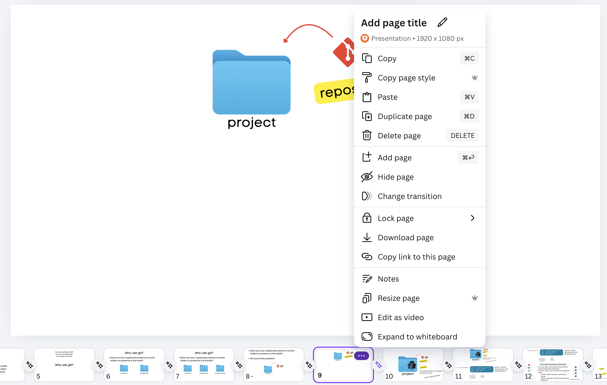
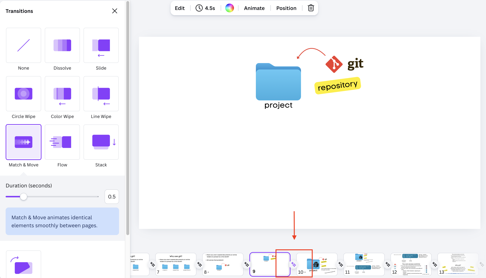

# Canva Tips
- Positioning
- Layers
- Alignment
- Animations
- Moving elements

---

# Positioning (Arrange)

- Click on any element in Canva
- At the top editor bar, click on "Position"
- This is helpful for layering elements or aligning them 

---

# Layers

- This is helpful when you can't click on an element that's behind another
- You can also drag and drop layers into the order that you want

---

# Shift Click to select multiple items for alignment

- You can shift click multiple items in "Layers"
- You can shift click multiple items directly on your Canvas
- Grouping items to become one giant element is also helpful (click on "Group" above the highlighted elements)

Use the "Align elements" and the "Space Evenly" tools

---

# Animations for Elements

- Click on any element you want to animate
- You can toggle animations through clicking
    - Useful for presenting when you want your audience to follow along
- You can decide if they animate when you enter or exit the frame (or both)

---

# Moving elements

- Duplicate a slide with elements on it
    - Click on the three dots setting for the individual slide to select duplicate
    - Or hit Cmd/Ctrl + D 

Duplicating slides makes the elements on slide A and B have the same IDs
- Copy/pasting elements to next slides DO NOT result in elements having the same ID

---

# Moving elements

- In between your duplicated slides, click on the animation transition icon
    - Choose "Match & Move"
- On the second slide, you can move and resize the duplicated elements
- The transition "Match & Move" will make those elements move!