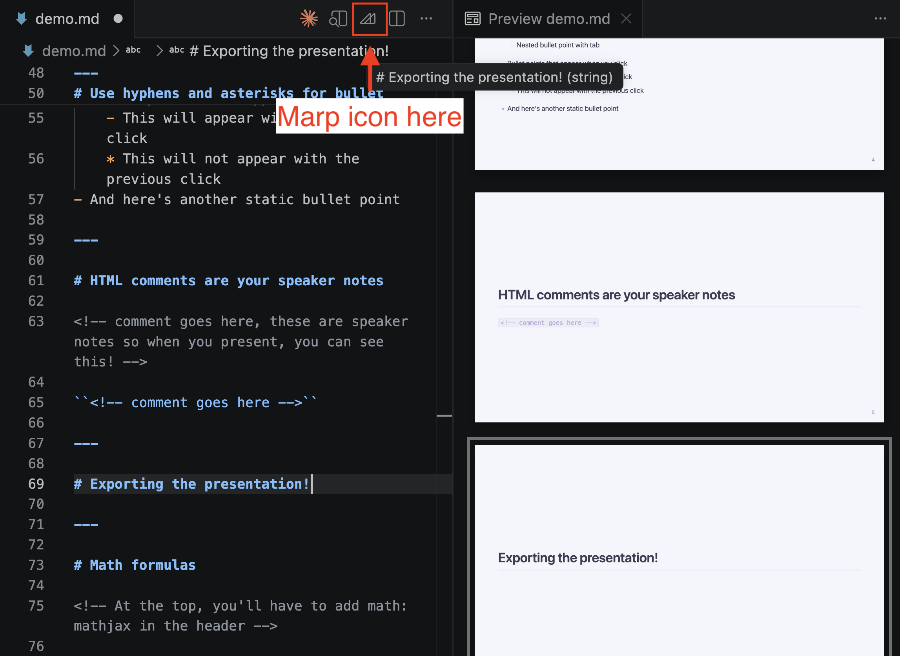
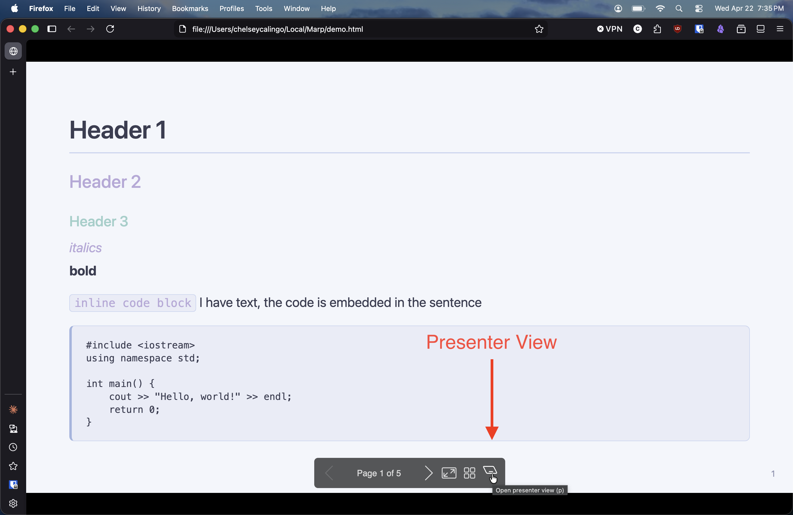

# Download the Marp for VS Code extention

You may have to close and reopen VS Code for Marp to take effect

Start a new project and create a file like "presentation.md"

You can initialize marp at the top with this header

```
---
marp: true
---
```

Use Ctrl/Cmd + Space to see possible options for the header

---

# Live preview
- Cmd/Ctrl + Shift + V
- Drag and drop the preview to a new "panel" in VS Code so you can edit and have a live preview next to your markdown file

---

# Header 1
## Header 2
### Header 3

*italics*
**bold**

``inline code block`` the code is embedded in this sentence

Multi-line code block
```
#include <iostream>
using namespace std;

int main() {
    cout >> "Hello, world!" >> endl;
    return 0;
}
```

---

# Use hyphens and asterisks for bullet points

- Here's a static bullet point
    - Nested bullet point with tab
* Bullet points that appear when you click
    - This will appear with the previous click
    * This will not appear with the previous click
- And here's another static bullet point

---

# HTML comments are your speaker notes

<!-- these are speaker notes so when you present, you can see this! -->

``<!-- comment goes here -->``

---

# Exporting the presentation!



- Click on the Marp icon
- You can choose which file type to export to 
- Try exporting to HTML! 

---

# Exporting the presentation!

- Exporting to HTML will automatically open the presentation in your default browser
- You could host this on GitHub pages!
- You can also double-click the .html file in your File Explorer/Finder to open it again

---

# Presenter View



Try presenter view, and an audience window and a presenter window will appear. You'll see your HTML comments in speaker notes

---

# Math formulas

In the header, add this ``math: mathjax``

Inline math formulas $e = mc^2$

Centered math block
$$
\frac{d}{dx} \sin{x} = \cos{x}
$$

You'll have to look up LaTeX to learn the ways

---

# Embedding images

This is what I do, but there are other ways to add images. 


<!-- it's also possible to use an https URL -->

<!-- bg makes the image a background
otherwise images are like  
You would have to adjust the position and size somehow -->

---

# Customizing themes

Marp comes with three themes
- default
- gaia
- uncover

```
---
marp: true
math: mathjax
theme: default
---
```

---

# You can create your own theme!

Marp supports HTML! So you can embed HTML things in it

It would also stand to reason that you can create a .css file to change the look of your Marp presentation

Feel free to use AI to prompt it to make you a separate .css file for a marp presentation

---

# Add the custom theme to marp settings

- Create a .vscode folder in this project
- Create a file called "settings.json"
- Enter this into the .json file

```
{
    "markdown.marp.themes": [
        "./theme1.css",
        "./theme2.css"
    ]
}
```